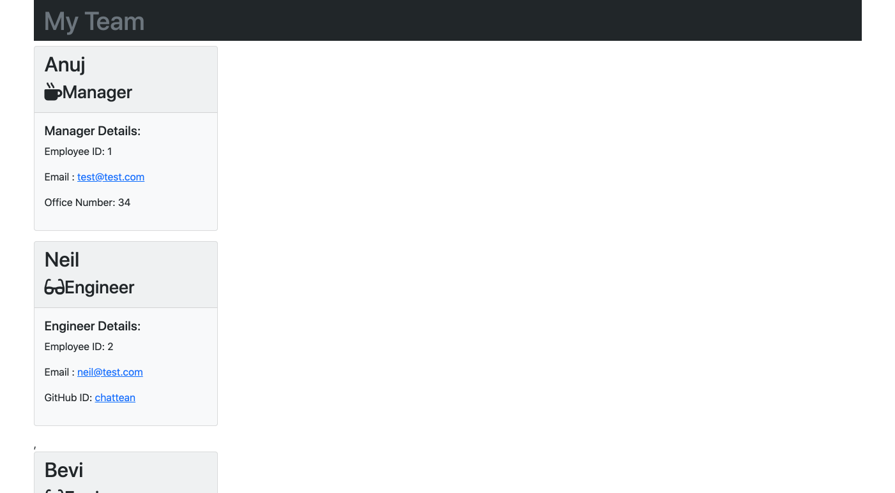

# Team Profile Generator

## Description

This will generate a Team Profile for your Team. Just answer the questions accurately and you are good to go.
    

## Table of Contents
* [Installation](#installation)
* [Usage](#usage)
* [Contributing](#contributing)
* [Tests](#tests)
* [Questions](#questions)

## Installation

    Go to the parent folder in terminal
    then just run 
    node index.js   
    or 
    npm start  

## Usage

### WalkThrough Video

[Walk Through Video](./assets/team-portfolio-generator.mp4)

### Sample ReadME:
[Sample HTML FILE](./assets/sample.html)

### Screenshot

## Contributing

Please contribute safely
    

## Tests

Please take a look at the __tests__ folder in the repository, it has the following tests:
Employee.js 
Engineer.js
Intern.js
Manager.js
    

## Questions
### Where is my GitHub repository?
[GitHub](https://github.com/chattean)

### How to get in Contact with me if you have additional questions?

anujchatterjee@gmail.com
    

